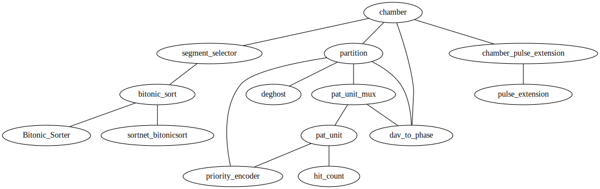

* Overview

=hdldep.el= is package for visualizing the module dependency
tree of HDL (Verilog + VHDL) projects. Uses tree-sitter for parsing.

Given a VHDL or Verilog file, =hdldep= walks the instantiation hierarchy
starting from the top-level entity/module and produces either:

- An interactive indented tree using =hierarchy.el=
- A rendered SVG dependency graph via Graphviz =dot=

* Usage

Open any VHDL (=.vhd=, =.vhdl=) or Verilog/SystemVerilog (=.v=, =.sv=) file that belongs to a =git= repository.

** Interactive Commands

*** =hdldep-graph-current-buffer= (recommended)

Generates a =.gv= (Graphviz) file and a rendered =.svg= for the module in the
current buffer, then displays the SVG. With a prefix argument (=C-u=), prompts
for a custom search directory instead of the project root.

#+begin_example
M-x hdldep-graph-current-buffer
#+end_example

*** =hdldep-hierarchy-current-buffer=

Displays the dependency tree as an indented, navigable list using =hierarchy.el=
in a tabulated buffer. With a prefix argument (=C-u=), prompts for a custom
search directory.

#+begin_example
M-x hdldep-hierarchy-current-buffer
#+end_example

#+begin_example
chamber
  chamber_pulse_extension
    pulse_extension
  partition
    deghost
    pat_unit_mux
      dav_to_phase
      pat_unit
        hit_count
        priority_encoder
  segment_selector
    bitonic_sort
      Bitonic_Sorter
      sortnet_bitonicsort
#+end_example

* How It Works

1. *Parse the current file* — tree-sitter extracts the top-level entity or
   module name.
2. *Find instantiated children* — tree-sitter queries identify every component
   or module instantiation in the file.
3. *Locate child source files* — =git grep= finds candidate files, then
   tree-sitter confirms which file defines the expected entity name.
4. *Disambiguate duplicates* — when multiple files define the same name (e.g.
   vendor overrides), port-name similarity scoring selects the best match.
5. *Recurse* — steps 2–4 repeat for each child until the full dependency DAG
   is built.
6. *Render* — the edge list is either rendered into a Graphviz =dot= graph or
   displayed via =hierarchy.el=.

Memoization (via =memoize.el= when available) caches per-file parse results so
repeated traversals of shared sub-hierarchies are faster.
